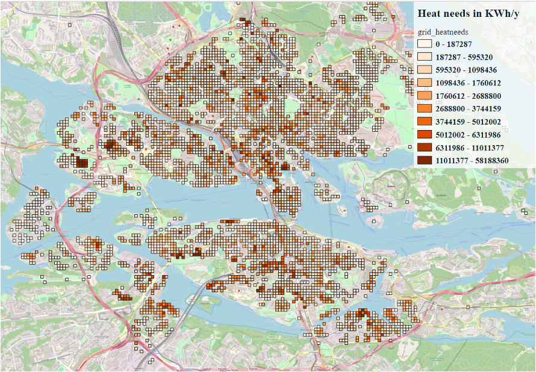

# High-resolution GIS mapping of heat sources and loads

This repository contains the workflow of constructing high-resoltion heat sorce-load mapping. The target users are district heating companies, city energy planners and decision makers.

## Data sources
The data is assembled from a variety sources and a database is consturcted to manage the geospatial data:
* OpenStreetMaps (free API)
* Google Maps (API charged based on number of requirements)
* Data Center Map
* Global Hydrography datasets
* ...

## Example results

